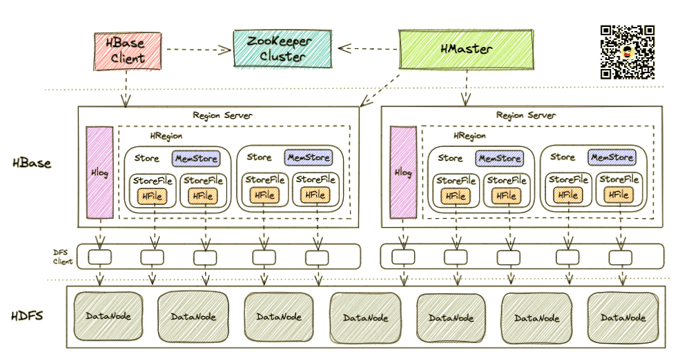

# 文章

## 58同城 HBase 平台建设实践 

https://www.sohu.com/a/396843161_315839

> **2. HBase平台之数据接入-SCF网关**
>
> SCF是我们公司内部的微服务框架。我们通过使用这统一的服务为使用方提供 HBase数据表的读写，而不是让用户直接拿着Zookeeper连接串直接操作 HBase，这样做的好处是让我们的平台内聚和服务化，和最重要的对核心 HBase集群的保护，补足 HBase针对限流场景的不足，以及我们可以依托这一层的设计，能做到对异常流量调用的熔断，我们可以清晰的做到流量监控，也可以依托云设施的部署便利性，能做到比较不错的隔离、扩容，另外在这一层方便管理对 Zookeeper集群的流量压力，而且还可以做跨集群数据高可用。 当然它也会带来不足，我认为首要的不足就是我们提供接口的灵活性不足，不能覆盖全部的场景，比如有使用Filter这种协处理器的场景。
>
> **4. HBase平台之Phoenix**
>
> **Phoenix本身是一个开源成熟的SQL on HBase的解决方案，可以使用标准的JDBC API替代HBase 原生的Client API创建表，以及读写HBase数据。**它有好多优秀的特性，支持二级索引；支持并行执行操作；计算移动到数据端；计算优化(谓词下推、semi-join)。
>
> 需要注意的地方：索引数量和形式这一方面需要去做好控制和管理，尤其需要注意全局构建索引的问题。
>
> 

## HBase流量限制和表负载均衡剖析

https://developer.aliyun.com/article/583276

>也许有同学有疑问，为啥要做流量限制，无限制全量跑不是更好吗？举个例子，比如今天的双十一日，数据流量是非常大的。如果不限制用户和表的流量，某些重要的核心业务，需要在资源有限的情况下优先保证正常运行。如果**非核心业务在此期间其QPS一直降不下来，严重消耗系统资源，影响核心业务的正常运作**。
>
>　　针对上述问题，可以采取以下方案来解决：
>
>- **资源限制：针对用户、命名空间及表的请求大小和QPS进行限制。**
>- **资源隔离：将不同表中的数据通过物理隔离，均衡到不同的RegionServer上。**

## HBase vs Redis

https://www.jianshu.com/p/74bd352d7493

> HBase 对比 Redis
>
> 二者都属于 NoSQL, 但又有很大不同:
>
> HBase 是一个分布式的、面向列的开源数据库，它是Apache的Hadooop项目的子项目。最初来源于Fay Chang所撰写的Google论文"Bigtable:一个结构化数据的;分布式存储系统"。一般和HDFS一起结合使用，能存储海量数据。
>
> Redis是一个开源的使用ANSI-C语言编写、支持网络、基于内存的日志型、Key-Value数据库;
>  优势是速度快，并发高;
>  缺点是数据类型有限，查询功能不强，一般用作缓存（当做DB用的，更多是允许丢失的数据)。
>  
>综上: 根据具体业务场景、数据量选择最合适的就好。
> 
>两者功能上比较相近，都属于nosql数据库，都支持数据分片存储，**一般来讲redis比较依赖内存，适合做缓存，hbase适合做大数据的持久存储**，两者适合的场景不太一样，主要区别有如下几点：
> 
>1.读写性能：hbase采用了LSM结构，写快读慢，hbase读延时在一般在几毫秒，redis读延时在几十微秒，性能相差比较大.
> 
>> LSM-Tree 全称是Log Structured Merge Tree，是一种分层、有序、面向磁盘的数据结构，其核心思想是充分利用磁盘的**顺序写性能要远高于随机写性能这一特性**，将**批量的随机写转化为一次性的顺序写LSM-Tree 被是一种面向写多读少应用场景的数据结构 ，被 Hbase、RocksDB 等强力 NoSQL 数据库采用作为底层文件组织方式。**
> >  [https://wingsxdu.com/post/database/leveldb/#gsc.tab=0](https://links.jianshu.com/go?to=https%3A%2F%2Fwingsxdu.com%2Fpost%2Fdatabase%2Fleveldb%2F%23gsc.tab%3D0)
> 
>2.数据类型：**hbase和redis都支持kv类型，但redis支持更丰富的集合类型list，set等**
> 
>3.数据量：redis在热数据比内存大时，性能下降比较厉害，非常依赖内存，hbase不存在这问题
> 
>4.部署复杂度：hbase 部署复杂，依赖 hadoop，zookeeper，redis 部署简单。
> 
>5.数据持久化：**hbase采用了 WAL，先记录日志再写入数据，理论上不会丢失数据，而redis采用的是异步复制数据，failover时可能丢失数据.**
> 
>HBase 是属于hadoop生态圈的组件，不可能脱离hdfs使用的。hbase部署起来较重，需要有一定人力搞定它。但是优点也是很明显的，作为分布式数据库，容灾以及扩展性都很棒。
> 
>Redis 更适合小场景的需求，优点是速度快，作为缓存是个不错的选择。但是大数据肯定不够玩。
> 
>hbase 是可以作为线上系统的后台的，实时性是建立在你们对表的设计和优化上的。如果人力允许，完全可以用**hbase+redis实现数据仓库加缓存数据库，速度和扩展性都兼顾。**

## [大数据之HBase数据库](https://blog.csdn.net/yanxifaner/article/details/120186136)  （对 hbase 的整体架构讲得很好）

https://blog.csdn.net/yanxifaner/article/details/120186136

>
>
>

## [Hbase技术详细学习笔记](https://baijiahao.baidu.com/s?id=1713249412624638551&wfr=spider&for=pc)

很长，也很详细。重点看体系结果和 hbase 读写 操作如何实现的部分。

## 什么是HBase？终于有人讲明白了

https://blog.csdn.net/weixin_43958974/article/details/125049446

Hbase 架构和基本概念讲得比较详细。

>HBase 的核心架构由五部分组成，分别是 HBase Client、HMaster、Region Server、ZooKeeper 以及 HDFS。它的架构组成如下图所示。
>
>
>
>**1.HBase Client**
>HBase Client 为用户**提供了访问 HBase 的接口**，可以通过元数据表来定位到目标数据的 RegionServer，另外 HBase Client 还维护了对应的 cache 来加速 Hbase 的访问，比如缓存元数据的信息。
>
>**2.HMaster**
>HMaster 是 HBase 集群的主节点，**负责整个集群的管理工作**，主要工作职责如下：
>
>分配Region：负责启动的时候分配Region到具体的 RegionServer；
>负载均衡：一方面负责将用户的数据均衡地分布在各个 Region Server 上，防止Region Server数据倾斜过载。另一方面负责将用户的请求均衡地分布在各个 Region Server 上，防止Region Server 请求过热；
>维护数据：发现失效的 Region，并将失效的 Region 分配到正常的 RegionServer 上，并且在Region Sever 失效的时候，协调对应的HLog进行任务的拆分。
>**3.Region Server**
>**Region Server 直接对接用户的读写请求，是真正的干活的节点**，主要工作职责如下。
>
>管理 HMaster 为其分配的 Region；
>负责与底层的 HDFS 交互，存储数据到 HDFS；
>负责 Region 变大以后的拆分以及 StoreFile 的合并工作。
>与 HMaster 的协同：当某个 RegionServer 宕机之后，ZK 会通知 Master 进行失效备援。下线的 RegionServer 所负责的 Region 暂时停止对外提供服务，Master 会将该 RegionServer 所负责的 Region 转移到其他 RegionServer 上，并且会对所下线的 RegionServer 上存在 MemStore 中还未持久化到磁盘中的数据由 WAL 重播进行恢复。
>
>下面给大家详细介绍下 Region Serve数据存储的基本结构，如下图所示。一个 Region Server 是包含多个 Region 的，这里仅展示一个。
>
>
>Region：每一个 Region 都有起始 RowKey 和结束 RowKey，代表了存储的Row的范围，保存着表中某段连续的数据。一开始每个表都只有一个 Region，随着数据量不断增加，当 Region 大小达到一个阀值时，Region 就会被 Regio Server 水平切分成两个新的 Region。当 Region 很多时，HMaster 会将 Region 保存到其他 Region Server 上。
>
>Store：一个 Region 由多个 Store 组成，每个 Store 都对应一个 Column Family, Store 包含 MemStore 和 StoreFile。
>
>MemStore：作为HBase的内存数据存储，数据的写操作会先写到 MemStore 中，当MemStore 中的数据增长到一个阈值（默认64M）后，Region Server 会启动 flasheatch 进程将 MemStore 中的数据写人 StoreFile 持久化存储，每次写入后都形成一个单独的 StoreFile。当客户端检索数据时，先在 MemStore中查找，如果MemStore 中不存在，则会在 StoreFile 中继续查找。
>StoreFile：MemStore 内存中的数据写到文件后就是StoreFile，StoreFile底层是以 HFile 的格式保存。HBase以Store的大小来判断是否需要切分Region。
>当一个Region 中所有 StoreFile 的大小和数量都增长到超过一个阈值时，HMaster 会把当前Region分割为两个，并分配到其他 Region Server 上，实现负载均衡。
>
>HFile：HFile 和 StoreFile 是同一个文件，只不过站在 HDFS 的角度称这个文件为HFile，站在HBase的角度就称这个文件为StoreFile。
>
>HLog：负责记录着数据的操作日志，当HBase出现故障时可以进行日志重放、故障恢复。例如，磁盘掉电导致 MemStore中的数据没有持久化存储到 StoreFile，这时就可以通过HLog日志重放来恢复数据。
>
>**4.ZooKeeper**
>**HBase 通过 ZooKeeper 来完成选举 HMaster、监控 Region Server、维护元数据集群配置等工作**，主要工作职责如下：
>
>选举HMaster：通ooKeeper来保证集中有1HMaster在运行，如果 HMaster 异常，则会通过选举机制产生新的 HMaster 来提供服务；
>监控Region Server: 通过 ZooKeeper 来监控 Region Server 的状态，当Region Server 有异常的时候，通过回调的形式通知 HMaster 有关Region Server 上下线的信息；
>维护元数据和集群配置：通过ooKeeper储B信息并对外提供访问接口。
>**5.HDFS**
>**HDFS 为 HBase 提供底层数据存储服务**，同时为 HBase提供高可用的支持， HBase 将 HLog 存储在 HDFS 上，当服务器发生异常宕机时，可以重放 HLog 来恢复数据。
>
>

## HBase的 rowkey 设计原则

https://blog.csdn.net/zjjcchina/article/details/122620415

>Rowkey设计原则
>
>**1.Rowkey的唯一原则**
>
>必须在设计上保证其唯一性。由于在HBase中数据存储是Key-Value形式，若HBase中同一表插入相同Rowkey，则原先的数据会被覆盖掉(如果表的version设置为1的话)，所以务必保证Rowkey的唯一性.
>
>**2.Rowkey的排序原则**
>
>HBase的Rowkey是按照ASCII有序设计的，我们在设计Rowkey时要充分利用这点。比如视频网站上对影片《泰坦尼克号》的弹幕信息，这个弹幕是按照时间倒排序展示视频里，这个时候我们设计的Rowkey要和时间顺序相关。可以使用"Long.MAX_VALUE - 弹幕发表时间"的 long 值作为 Rowkey 的前缀。
>
>**3.Rowkey的散列原则**
>
>我们设计的Rowkey应均匀的分布在各个HBase节点上。拿常见的时间戳举例，假如Rowkey是按系统时间戳的方式递增，Rowkey的第一部分如果是时间戳信息的话将造成所有新数据都在一个RegionServer上堆积的热点现象，也就是通常说的Region热点问题， 热点发生在大量的client直接访问集中在个别RegionServer上（访问可能是读，写或者其他操作），导致单个RegionServer机器自身负载过高，引起性能下降甚至Region不可用，常见的是发生jvm full gc或者显示region too busy异常情况，当然这也会影响同一个RegionServer上的其他Region。
>
>Region热点问题
>
>**1、Reverse 反转**
>针对固定长度的Rowkey反转后存储，这样可以使Rowkey中经常改变的部分放在最前面，可以有效的随机Rowkey。
>
>反转 Rowkey 的例子通常以手机举例，可以将手机号反转后的字符串作为Rowkey，这样的就避免了以手机号那样比较固定开头(137x、15x等)导致热点问题，这样做的缺点是牺牲了Rowkey的有序性。
>
>**2、Salt加盐**
>Salt是将每一个Rowkey加一个前缀，前缀使用一些随机字符，使得数据分散在多个不同的Region，达到Region负载均衡的目标。
>
>比如在一个有4个Region(注：以 [ ,a)、[a,b)、[b,c)、[c, )为Region起至)的HBase表中，加Salt前的Rowkey：abc001、abc002、abc003
>我们分别加上a、b、c前缀，加Salt后Rowkey为：a-abc001、b-abc002、c-abc003
>
>可以看到，加盐前的Rowkey默认会在第2个region中，加盐后的Rowkey数据会分布在3个region中，理论上处理后的吞吐量应是之前的3倍。由于前缀是随机的，读这些数据时需要耗费更多的时间，所以Salt增加了写操作的吞吐量，不过缺点是同时增加了读操作的开销。
>
>**3、Hash散列或者Mod**
>用Hash散列来替代随机Salt前缀的好处是能让一个给定的行有相同的前缀，这在分散了Region负载的同时，使读操作也能够推断。确定性Hash(比如md5后取前4位做前缀)能让客户端重建完整RowKey，可以使用get操作直接get想要的行。
>
>4.Rowkey的长度原则
>
>复制代码
>Rowkey长度设计原则：Rowkey是一个二进制，Rowkey的长度被很多开发者建议说设计在10~100个字节，建议是越短越好。
>
>原因有两点：
>其一是HBase的持久化文件HFile是按照KeyValue存储的，如果Rowkey过长比如500个字节，1000万列数据光Rowkey就要占用500*1000万=50亿个字节，将近1G数据，这会极大影响HFile的存储效率；
>
>其二是MemStore缓存部分数据到内存，如果Rowkey字段过长内存的有效利用率会降低，系统无法缓存更多的数据，这会降低检索效率；
>
>需要指出的是不仅Rowkey的长度是越短越好，而且列族名、列名等尽量使用短名字，因为HBase属于列式数据库，这些名字都是会写入到HBase的持久化文件HFile中去，过长的Rowkey、列族、列名都会导致整体的存储量成倍增加.

# **官网**

# Data Model

https://hbase.apache.org/book.html#datamodel

# RegionServer Sizing Rules of Thumb

https://hbase.apache.org/book.html#regionserver_sizing_rules_of_thumb

# Architecture

https://hbase.apache.org/book.html#_architecture

## 66. Overview

### 66.1. NoSQL?

HBase is a type of "NoSQL" database. "NoSQL" is a general term meaning that the database isn’t an RDBMS which supports SQL as its primary access language, but there are many types of NoSQL databases: BerkeleyDB is an example of a local NoSQL database, whereas HBase is very much a distributed database. Technically speaking, HBase is really more a "Data Store" than "Data Base" because it lacks many of the features you find in an RDBMS, such as typed columns, secondary indexes, triggers, and advanced query languages, etc.

However, HBase has many features which supports both linear and modular scaling. HBase clusters expand by adding RegionServers that are hosted on commodity class servers. If a cluster expands from 10 to 20 RegionServers, for example, it doubles both in terms of storage and as well as processing capacity. An RDBMS can scale well, but only up to a point - specifically, the size of a single database server - and for the best performance requires specialized hardware and storage devices. HBase features of note are:

- Strongly consistent reads/writes: HBase is not an "eventually consistent" DataStore. This makes it very suitable for tasks such as high-speed counter aggregation.
- Automatic sharding: HBase tables are distributed on the cluster via regions, and regions are automatically split and re-distributed as your data grows.
- Automatic RegionServer failover
- Hadoop/HDFS Integration: HBase supports HDFS out of the box as its distributed file system.
- MapReduce: HBase supports massively parallelized processing via MapReduce for using HBase as both source and sink.
- Java Client API: HBase supports an easy to use Java API for programmatic access.
- Thrift/REST API: HBase also supports Thrift and REST for non-Java front-ends.
- Block Cache and Bloom Filters: HBase supports a Block Cache and Bloom Filters for high volume query optimization.
- Operational Management: HBase provides build-in web-pages for operational insight as well as JMX metrics.